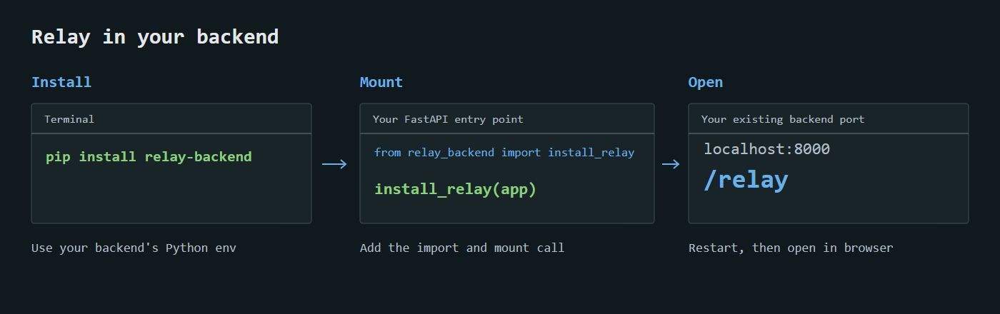

# Relay

<picture>
  <source media="(prefers-color-scheme: dark)" srcset="apps/web/public/brand/relay-logo.svg" />
  
</picture>

A local API tester for your backend: categorized endpoints, clear responses, quick authentication and one status control beside each API.

## Add Relay to FastAPI



### 1. Install

In your backend's Python environment (Python 3.11+):

```sh
python -m pip install relay-backend
```


A fresh installation gets the latest stable release. To update an existing installation:

```sh
python -m pip install --upgrade relay-backend
```

Restart the backend after upgrading. The browser title uses your application's name: `FastAPI(title="Ludo Portal")` becomes `Relay - Ludo Portal`. Any application's title works.

### 2. Add two lines

In the file where you create `app = FastAPI()`:

```python
from relay_backend import install_relay
install_relay(app)
```

### 3. Open `/relay`

Restart your backend with its usual command. Open `/relay` on that backend's port. For example, a backend at `http://localhost:8000` gets Relay at `http://localhost:8000/relay`.

That's the setup. Relay includes the UI, fonts and assets, discovers your APIs from OpenAPI, and executes through your app's middleware and dependencies.

<details>
<summary>Optional settings and integration details</summary>

Use your development setting to control installation:

```python
install_relay(app, enabled=settings.DEBUG)
```

Install before wrapping FastAPI with Socket.IO. Application factories, custom OpenAPI generators, lifespan and proxy prefixes are covered in the [FastAPI integration guide](docs/FASTAPI.md). Alternatively, install the wheel attached to the [v0.0.3 release](https://github.com/nibir-ai/relay/releases/tag/v0.0.3).

The distribution name is **relay-backend**. The import is **relay_backend** and the CLI is **relay**. Existing `from relay_agent import install_relay` integrations remain compatible. The `relay-agent` project on PyPI is unrelated.

</details>

## What Relay includes

- Inline APIs grouped by OpenAPI tags, method colors, search and editable request inputs. Endpoint definitions remain code-generated.
- Shared or per-endpoint authorization with explicit Authorize actions; advanced bearer, Basic and header API key settings.
- Request execution, response inspection, copy controls, response focus, optional line wrapping and code snippets.
- Manual statuses defaulting to Done, Git-shared status updates and native FastAPI handler attribution.
- Everblush, One Dark, Gruvbox, Nord and Paper themes with Relay branding.
- Per-endpoint `.relay` browser reports and structured JSON exports, plus a local report opener and Windows file association.
- A standalone CLI for loopback OpenAPI backends.

Relay is an alpha for local development. Multipart uploads, OAuth browser flows, YAML/external references and public hosting are outside its scope. A successful request does not automatically change status. Optional automatic team status sync uses your existing Git remote; see the [team setup guide](docs/GIT.md).

Tokens and drafts stay in browser session memory. Explicit exports include request bodies, parameters and captured responses, which may contain secrets; inspect them before sharing. See the [export format and handling guide](docs/EXPORTS.md).

## Roadmap: v0.0.2

- [x] Ship the refined Relay branding consistently across the tester, reports and documentation.
- [x] Harden request testing for nested bodies, optional fields, arrays, path/query parameters, validation errors and empty responses.
- [x] Clarify effective authentication and keep shared and endpoint credentials independent, with quick switching.
- [x] Improve large-response inspection, truncation feedback and accurate copying and exports.
- [x] Verify seamless FastAPI integration with routers, application factories and Socket.IO; provide a small runnable example.
- [x] Finish illustrated setup guides, the package README and troubleshooting documentation.

Release gate: fresh package installation, endpoint discovery, authentication, execution, response inspection and both export formats verified without frontend tooling. See [verification notes](docs/VERIFICATION.md). Additional frameworks, cloud collaboration and premium tools remain outside this release.

## Roadmap: v0.0.3

- [x] Use `pip install relay-backend` for the latest fresh installation and document upgrades.
- [x] Make `relay_backend` the public Python import while preserving existing integrations.
- [x] Display `Relay - <app name>` automatically from each application's OpenAPI title.
- [x] Verify bundled branding and asset refresh from a clean published-package installation.
- [x] Remove unused artwork and private development metadata from public source and packages.
- [x] Add opt-in automatic team status sync without manual Git commands or changing working files.
- [x] Migrate the Ludo backend to the tested published package and verify its native integration.
- [x] Pass package, frontend, Python, cross-environment sync and release checks before publication.

Issue maintenance checks run every four hours and update this checklist when fixes are verified.

## Node package: v0.0.3

The npm package provides the bundled tester for JavaScript and TypeScript backends. See [Node integration](docs/NODE.md) for minimal Express and Fastify setup. Publication is pending registry authentication; use the npm install command after the package is published.

- [x] Native Express middleware, Fastify plugin and Node HTTP integration.
- [x] Bundle the UI without Python, a consumer build or a repository clone.
- [x] Support CommonJS, ES modules and TypeScript declarations.
- [x] Verify API execution, authentication, response limits and status persistence.
- [x] Verify automatic status sharing between independent Git peers.
- [x] Verify the tarball in clean consumer installations and CI on supported Node versions.
- [ ] Publish the verified npm package and check a fresh registry installation.

## Documentation

Start with the [documentation index](docs/README.md).

- [FastAPI setup and configuration](docs/FASTAPI.md)
- [JavaScript and TypeScript backends](docs/NODE.md)
- [Testing requests, authentication and responses](docs/TESTING.md)
- [Git status and source attribution](docs/GIT.md)
- [Exports and opening `.relay` files](docs/EXPORTS.md)
- [Troubleshooting](docs/TROUBLESHOOTING.md)
- [Contributing and verification](docs/CONTRIBUTING.md)
- [Release and PyPI publishing](docs/RELEASING.md)
- [Brand identity](docs/BRAND.md)

## License

Relay is [Apache-2.0](LICENSE). Bundled frontend dependencies and font licenses are included in [third-party notices](THIRD_PARTY_NOTICES.md).
