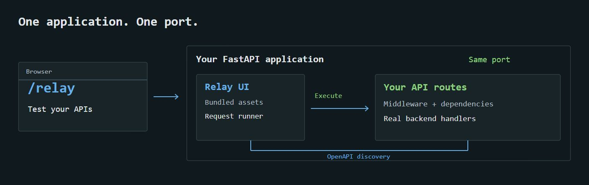

# Relay architecture

Native FastAPI mounts the compiled React UI, assets, and internal `/__relay` API under `/relay`. The standalone CLI serves the same namespaced UI and retains its legacy root `/__relay` API. `security.py` checks origins, paths, and headers; `openapi.py` normalizes code-generated contracts; `executor.py` runs bounded HTTPX requests without redirects or ambient proxies.

`Operations.tsx` categorizes endpoints by OpenAPI tags. `Playground.tsx` builds editable request inputs and displays real response text. Imported methods, paths, schemas, and categories are never edited in Relay. Changed fingerprints reset obsolete drafts; unchanged syncs preserve session inputs/results. Failed imports preserve the previous in-memory snapshot.

`App.tsx` opens shared and endpoint authorization in a compact dialog, applies tokens only on submission, and keeps credentials in React memory. `Playground.tsx` exposes advanced auth overrides inline; its execution action sits above the request. Headers and code snippets use labeled disclosures. Request drafts and live results also stay in session memory, capped at twenty endpoints. Reload clears them. Copy actions support resolved URLs, headers, and the selected response representation. Code snippets redact common credential fields.

`workspace.py` persists local status in SQLite. `git_status.py` optionally overlays shared `.relay/status.json`, using atomic writes and a lock. It records Git-configured identity, not authenticated users. Without automatic sync, Git sharing uses normal commits and pulls. With `sync_status=True`, `status_sync.py` exchanges status metadata on a separate `relay-status` branch. Changed contracts invalidate Done without fabricating a new teammate action. Neither HTTP success nor status grants an approval.

`integration.py` mounts a development subapplication excluded from OpenAPI and composes its resource lifespan with the host lifespan. It reads the host OpenAPI function and executes through the host ASGI middleware/dependency stack without subprocesses or extra ports. Response retention is capped before HTTPX buffers the ASGI body; each execution gets a fresh cookie jar. Remote clients cannot access Relay. The CLI remains available independently. `scripts/package.py` bundles assets into a Python wheel, and `scripts/verify_package.py` verifies an isolated installation.

Browser execution payloads supply relative paths only. Exact Host/Origin/Fetch Metadata/CSRF checks protect the runner; limits bound requests, responses, and execution time. This boundary blocks unrelated browser origins, not malicious local processes. Responses render as text. There is no cloud executor or public production integration.

Contract snapshots are ephemeral. Automatic status synchronization polls the Git remote every ten seconds; visible browser tabs refresh workspace metadata every five seconds. It commits a status-only tree and never checks out a branch, stages files, merges code or forces a push. Concurrent pushes retry after merging the latest endpoint edits. No hosted collaboration service is required. The UI stays focused on testing plus an endpoint status selector.
