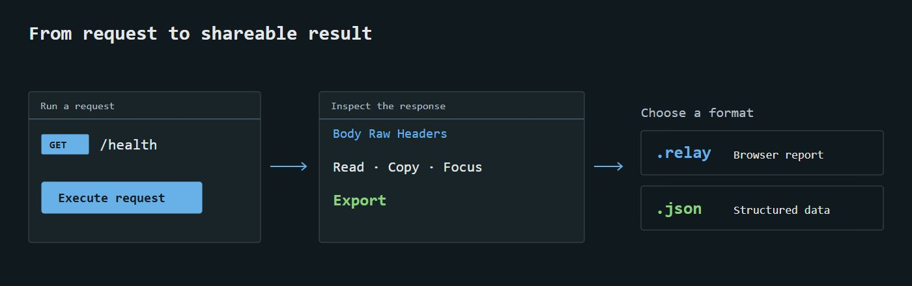

# Exports



Export beside Execute offers Relay (`.relay`) or JSON (`.json`); it never sends a request. Both include endpoint details/contract/progress, current inputs/body and latest captured response. Current inputs are separate because they may have changed since execution. No result means `latest_response: null`.

Structured data uses `relay.endpoint`, version 1. Report marker is `relay.endpoint.report.v1`. These are Relay formats, not Postman collections; import-as-executable-collection is not included.

Responses preserve timestamp, URL/method, status, headers, raw body, timing, bytes and truncation. Invalid custom headers export as null plus `header_error`; unfinished body text can be exported. Report JSON is formatted for reading, with expandable contract/full-data sections.

Session credentials are omitted; recognizable authorization/cookie/token/secret/API-key custom headers are redacted. Bodies, parameters and response contents remain exact in structured data and can contain secrets. Truncation means the retained preview, not a complete server body.

## Open offline

```sh
relay open "/path/to/api.relay"
```

The opener validates UTF-8 HTML/report marker, caps files at 32 MiB, copies to `~/.relay/reports/<hash>.html`, then opens your default browser. Original reports remain intact; cached copies persist until removed. No backend/server is needed.

Windows double-click registration:

```powershell
relay associate
```

Registration is per-user and references the current Python environment; keep Relay installed there. Another application's association is not overwritten. Windows UserChoice is not bypassed; choose Relay explicitly in Open with if needed. macOS/Linux use `relay open`; automatic desktop association is outside v0.0.1.

Reports embed font/brand assets, contain no scripts, and prohibit external resources through CSP. Recipients without Relay can copy the HTML-based report to a `.html` filename and open that copy. A custom extension cannot itself install an OS association.
