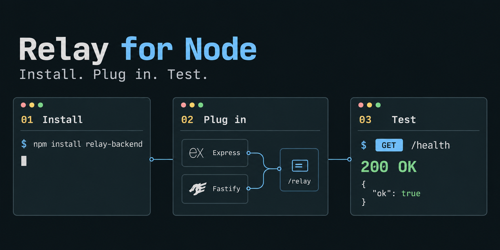

# Node integration

The [published npm distribution](https://www.npmjs.com/package/relay-backend) is `relay-backend`, version 0.0.3. It contains the compiled Relay UI and native Node implementation. Python is not needed. Node 22.13+ is required.

```sh
npm install relay-backend
```

For an existing installation, `npm install relay-backend@latest` upgrades the package. npm resolves the latest release when installing a new dependency; an existing lockfile preserves the version it records.

See the [package quick start](../packages/node/README.md) for Express and Fastify. Both CommonJS `require('relay-backend')` and ESM `import` work, including TypeScript declarations.



## Where the schema comes from

Relay uses your generated OpenAPI 3.0/3.1 JSON. It never edits endpoint definitions. Express integration takes `openapi: document`, a synchronous/asynchronous provider, or fetches `/openapi.json` from the same backend by default. Fastify integration uses `app.swagger()` when available. Register the Swagger generator before your API routes and Relay.

For a custom JSON route, use `specPath: '/api/openapi.json'`. The title comes from `info.title`: `My Portal` becomes `Relay - My Portal`.

Express does not include a schema generator. Keep using your current generator; undocumented routes and TypeScript interfaces cannot be discovered as complete request contracts. NestJS can produce a document using its Swagger integration, but it has no dedicated tested Relay adapter in this release. Deno, Bun, serverless environments and other frameworks are not part of the verified Node support.

## Options

| Option | Default | Meaning |
| --- | --- | --- |
| `openapi` | Same-app `/openapi.json` | JSON document or provider returning one |
| `enabled` | `true` | `false` registers no tester routes |
| `specPath` | `/openapi.json` | Same-app generated JSON schema route |
| `project` | Git repository above the working directory | Explicit repository path; `false` disables Git |
| `syncStatus` | `false` | Automatically exchange statuses with Git `origin` |
| `dataDir` | `~/.relay` | Local metadata folder; `false` keeps workspace metadata in memory |
| `target` | Current backend origin | Loopback HTTP(S) origin for standalone use |

`dataDir: false` does not disable Git persistence; set `project: false` as well for entirely temporary statuses. `syncStatus` needs Git identity and remote access. Each process owns its local workspace; share statuses through Git rather than pointing multiple workers at the same metadata file.

Mount at the application root. This version serves `/relay` and `/relay/`; mounting below another path prefix is not supported. Install Express middleware before body parsers and catch-all routes. Keep Relay disabled in production. Existing backend authentication hooks remain active: allow local Relay routes through broad hooks and authenticate individual test requests using Relay's Auth controls.

## Node HTTP

```js
import http from 'node:http';
import { relay } from 'relay-backend';
import { openapi } from './generated-openapi.js';

const tester = relay({ openapi });
const server = http.createServer((req, res) => {
  void tester(req, res, () => {
    // Your existing request handler.
    res.writeHead(404).end();
  });
});
server.on('close', () => void tester.close());
server.listen(3000, '127.0.0.1');
```

Express/Node integrations should call `tester.close()` at shutdown, especially with team sync enabled. The Fastify adapter registers its own `onClose` hook.

## Limits and privacy

Relay accepts only loopback client addresses and hosts. Unsafe tester requests require its local CSRF token and matching Origin. The request runner rejects arbitrary external destinations, recursive Relay requests and unsafe forwarded headers. It does not follow redirects or retain a cookie jar. Responses are capped at 2 MiB and request JSON at 1 MiB, with truncation/limit feedback.

Authentication tokens and request drafts remain in browser session memory. Exports deliberately include captured data; review them before sharing. Local workspace metadata stores statuses, contract fingerprints and activity, not API traffic. Git sync stores endpoint status and the updater's configured Git identity. It does not currently attribute Node handler authors.

## Missing dependency

If Node says it cannot find `relay-backend`, run `npm install relay-backend` in the backend directory and restart. Python backends use `pip install relay-backend` instead. Installing one distribution does not install the other.

## Verification

The test suite exercises actual Express and Fastify servers, schema discovery, existing authentication hooks, request body/query handling, response limits, redirects, CSRF, persistent statuses and independent Git peers. Release checks also install the packed tarball outside the repository and test both JavaScript module formats and TypeScript consumers.
