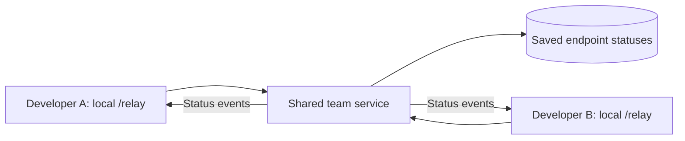

# Shared team statuses: proposed next release

This is a design proposal. It is not shipped in Relay 0.0.3.

The goal is simple: a developer changes the status beside an API; the other developers see the change and its author without Git commands or a status branch. API testing remains the main workspace.

## Proposed flow

Each local Relay integration connects to the same authenticated team service. The service persists endpoint status, contract fingerprint, authenticated updater and timestamp, then broadcasts an update to that project's members. Socket.IO provides project rooms and connection middleware; it does not replace durable storage. See its [server API](https://socket.io/docs/v4/server-api/).

Local API requests, bearer tokens, request bodies and captured responses stay in the developer's testing environment. Only team status metadata goes to the shared service. A backend bridge can preserve the local browser's existing same-origin flow.

## Contributor access

Use an authenticated developer identity with repository collaborator/team checks, or an explicit developer allowlist. A Git-configured name alone does not authenticate someone. For public repositories, being able to clone the code does not imply permission to change team statuses.

## Release requirements

- Minimal setup: one shared service address and developer sign-in, or a verified host-backend authentication adapter.
- Durable status storage with project isolation and membership enforcement.
- Server acknowledgements and explicit conflict handling for simultaneous edits.
- Full state recovery after reconnect, including changes missed while offline.
- API testing stays usable when collaboration is unavailable; sync failure is visible.
- Verify two separate developer environments, unauthorized clients, reconnects and concurrent updates before shipping.

Independent localhost servers need a shared destination to communicate. Adding Socket.IO to each local server alone does not connect the team. The implementation should make that shared destination easy to configure and avoid creating a Git status branch in this mode.
