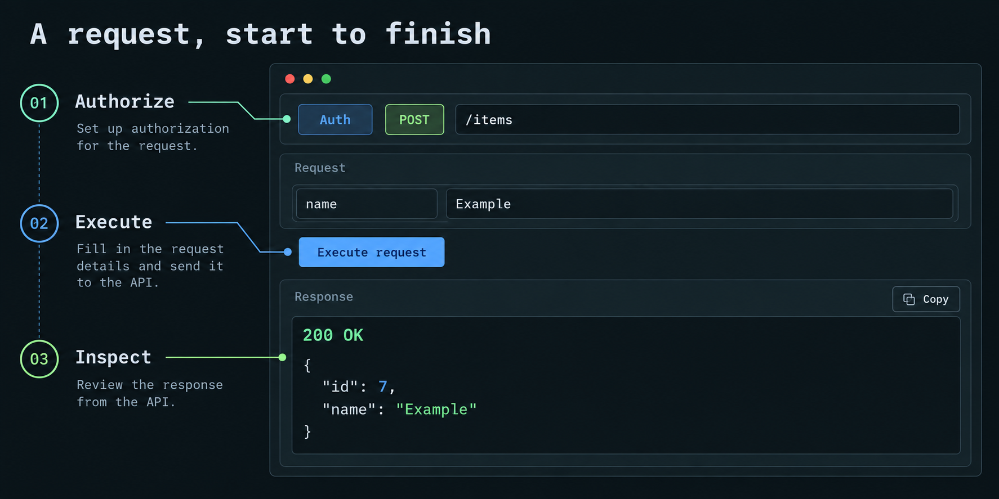
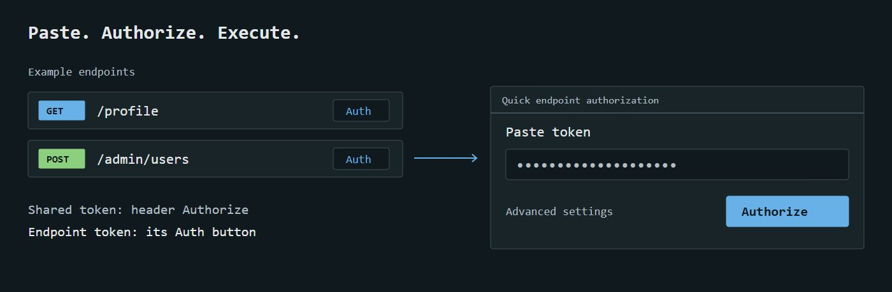

# Testing APIs

## Find and execute

Endpoints are read-only definitions from OpenAPI, grouped by their first tag. Search matches method/path/summary/category; method and status filters narrow results. Open all/Close all controls visible categories, and APIs expand inline.

Enter path/query/header/cookie values and a request body. Execute request is above the inputs. `/` focuses search; `Ctrl+Enter`/`Cmd+Enter` executes the active endpoint.

Generated fields cover straightforward JSON objects; the JSON editor handles more complex schemas. JSON, text and URL-encoded form bodies are supported. Missing required inputs and invalid JSON are checked before execution. Multipart upload is not supported.

For array query parameters, enter a JSON array such as `["active", "pending"]`. FastAPI's default sends repeated keys (`?tag=active&tag=pending`); explicitly declared comma, space and pipe styles are also supported. Nested objects and body arrays use the JSON editor. Remove an optional property there to omit it, or enter `null` where the schema permits it. Read-only properties are excluded from generated request examples. Clear an optional body completely to send no body; a required body cannot be blank.

Native execution invokes real handlers, middleware, dependencies, validation and startup state. It can change development data. HTTP 401/404/422 responses are inspectable backend responses, not necessarily Relay transport errors.

## Auth

Header Authorize sets shared bearer auth. Paste with or without `Bearer`, then explicitly submit Authorize. Cancel/Escape discards unsubmitted edits.

Endpoint Auth beside status supports distinct admin/user credentials without expanding the API. Use shared auth resets the override. Advanced settings offers Shared bearer, Endpoint bearer, Basic, header API key and None. None suppresses shared auth. Backend permissions remain authoritative; Relay does not grant roles.

Credentials and request drafts remain in session memory across endpoint switches and clear on reload. A token found in a response can be applied with Use as bearer token. OAuth browser authorization flows are out of scope; manually obtained tokens work.

Headers accept JSON string values or `Name: value` lines. Duplicate names/invalid input are rejected. The runner manages Host and transport headers.

The auth line shows the credentials that will be used, including a custom Authorization header. Endpoint overrides do not mutate the shared token. API key auth can accompany an explicitly entered Authorization header. Basic credentials use `username:password`; empty or malformed credentials are rejected before sending.

## Response inspection

The desktop response pane is wider. Focus response makes it full width; Back to request preserves inputs. Narrow screens stack panes. Body formats JSON where possible; Raw keeps captured text. Headers and Request expose metadata. Wrap lines is optional; default unwrapped lines preserve JSON structure.

JSON formatting preserves original numeric values, including integers beyond JavaScript's safe range. Payloads over 200,000 characters stay unformatted to keep inspection responsive. Empty bodies are labeled explicitly; Copy still copies the actual empty body. A failed request or invalid edit preserves the last captured response and its timestamp until a new response arrives.

Copy acts on the selected view. Copy request URL includes entered path/query values. Generated code snippets redact recognizable secrets. Export offers a browser report or structured JSON without executing a request.

Metadata shows status, duration and retained bytes. Requests cap at 1 MiB, response/spec retention at 2 MiB and execution at 20 seconds. Truncation is labeled and carried into exports. Redirects are shown without following; response cookies never become implicit auth on future runs.

When a response is truncated, Copy and Export contain only the retained preview. Relay does not silently fetch or claim to preserve the full body.

## Sync and progress

Sync reloads schema; Auto refresh checks the schema every ten seconds. Team statuses refresh independently when automatic Git sync is enabled. Invalid imports preserve the previous successful contract. FastAPI's schema cache still applies. Done is the default manual status; execution never changes it. A contract change can flag a previously Done API as Needs fixing.

## Execution boundaries

Relay enforces loopback Host/client checks, Origin, Fetch Metadata and CSRF. Native ASGI execution does not test network/TLS/DNS or middleware outside the FastAPI host. Standalone mode targets literal loopback HTTP origins, with redirects and ambient proxies disabled.
